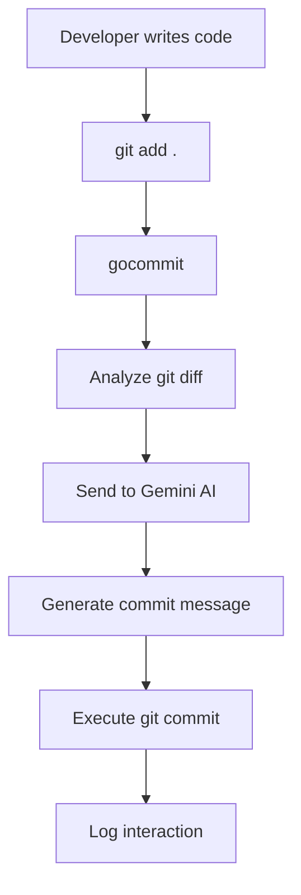
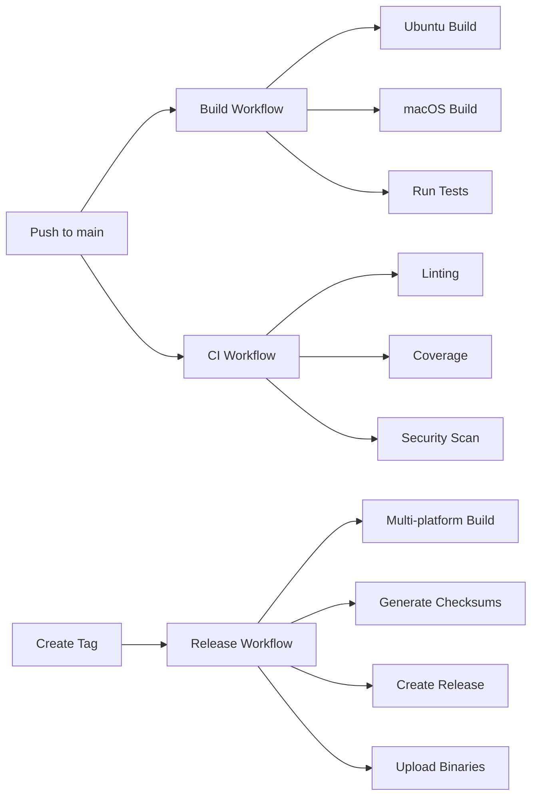
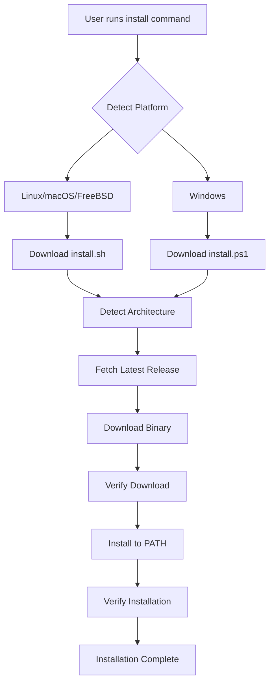
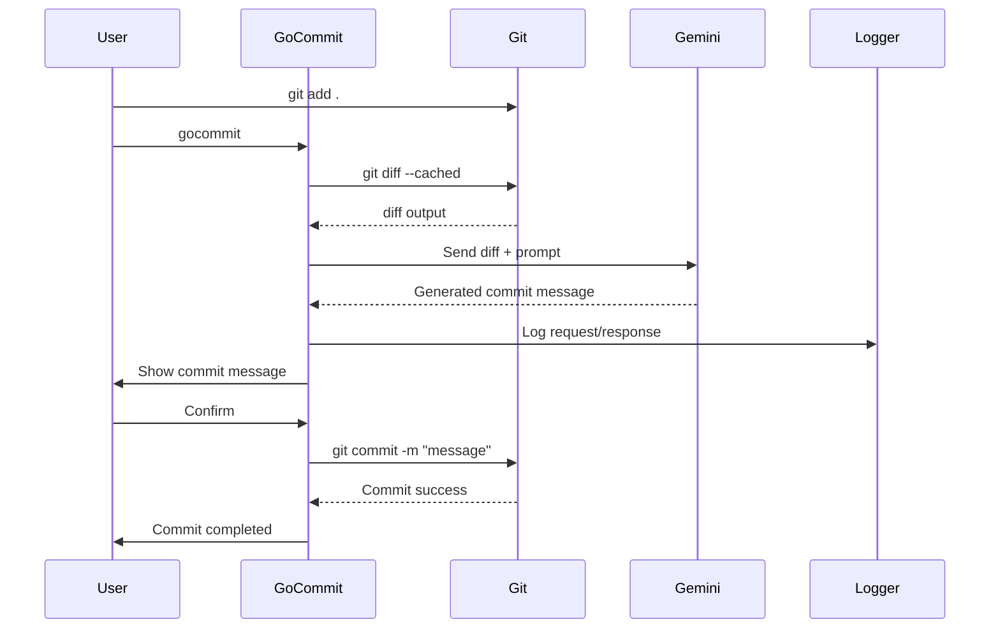
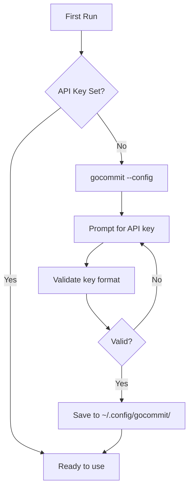
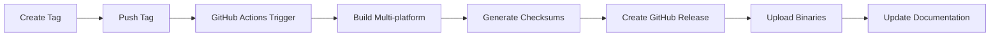
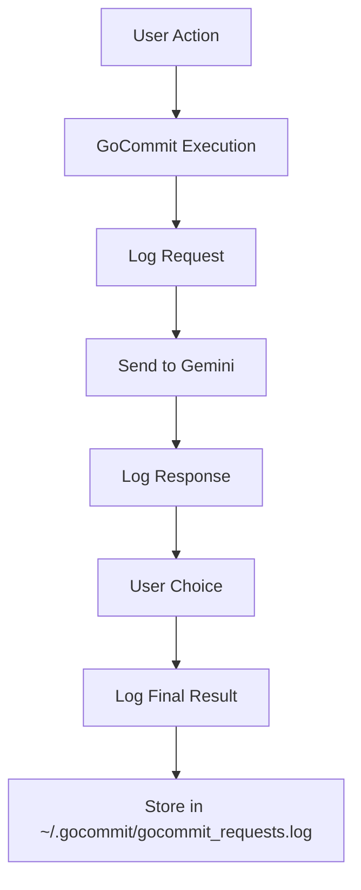
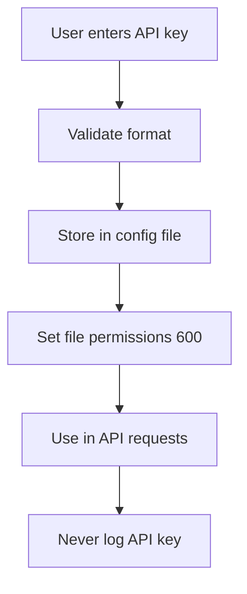
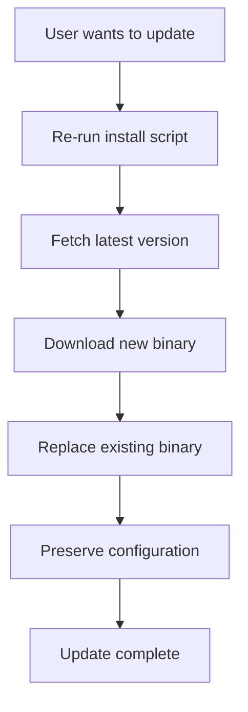
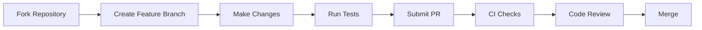

# GoCommit Project Flow Documentation

This document explains how the GoCommit project works, from development to deployment and usage.

## 📋 Project Overview

GoCommit is an AI-powered git commit message generator that uses Google's Gemini API to analyze staged changes and generate meaningful commit messages following conventional commit formats.

## 🏗️ Project Architecture

```
┌─────────────────────────────────────────────────────────────────┐
│                          GoCommit Architecture                   │
├─────────────────────────────────────────────────────────────────┤
│                                                                 │
│  ┌─────────────┐    ┌─────────────┐    ┌─────────────────────┐  │
│  │    main.go  │────│  config/    │────│     logger/         │  │
│  │   (CLI)     │    │ config.go   │    │   logger.go         │  │
│  │             │    │ (API keys)  │    │ (logging system)    │  │
│  └─────────────┘    └─────────────┘    └─────────────────────┘  │
│         │                                         │              │
│         │                                         ▼              │
│         ▼                                  ┌─────────────────┐   │
│  ┌─────────────┐                          │ ~/.gocommit/    │   │
│  │   Git Diff  │                          │ gocommit_       │   │
│  │  Analysis   │                          │ requests.log    │   │
│  └─────────────┘                          └─────────────────┘   │
│         │                                                        │
│         ▼                                                        │
│  ┌─────────────────────────────────────────────────────────────┐│
│  │              Google Gemini AI API                           ││
│  │         (Commit Message Generation)                         ││
│  └─────────────────────────────────────────────────────────────┘│
│         │                                                        │
│         ▼                                                        │
│  ┌─────────────┐                                                 │
│  │ Git Commit  │                                                 │
│  │  Execution  │                                                 │
│  └─────────────┘                                                 │
│                                                                 │
└─────────────────────────────────────────────────────────────────┘
```

## 🔄 Development Workflow

### 1. Code Development Flow



### 2. CI/CD Pipeline Flow



## 🚀 Installation Flow

### Quick Installation Process



### Platform-Specific Installation

| Platform | Command | Script |
|----------|---------|--------|
| **Linux/macOS** | `curl -sSL https://raw.githubusercontent.com/thanhphuchuynh/gocommit/main/install.sh \| bash` | `install.sh` |
| **Windows** | `Invoke-WebRequest -Uri "..." -OutFile "install.ps1"; .\install.ps1` | `install.ps1` |
| **Manual** | Download from releases page | N/A |

## 📊 Usage Flow

### Basic Usage Workflow



### Configuration Flow



## 🔧 Core Components

### 1. Main Application (`main.go`)
- **Purpose**: Command-line interface and orchestration
- **Features**:
  - Command-line argument parsing
  - Git integration
  - User interaction
  - Workflow coordination

### 2. Configuration (`config/config.go`)
- **Purpose**: API key management and validation
- **Features**:
  - Secure API key storage
  - Key format validation
  - Configuration file management

### 3. Logging (`logger/logger.go`)
- **Purpose**: Request/response logging for analysis
- **Features**:
  - JSON structured logging
  - Request/response tracking
  - Error logging
  - Performance metrics

### 4. Build System
- **Makefile**: Local development commands
- **GitHub Actions**: Automated CI/CD
- **Install Scripts**: Cross-platform installation

## 📈 Release Process

### Version Release Flow



### Release Artifacts

For each release, the following binaries are built:
- `gocommit-linux-amd64`
- `gocommit-linux-arm64`
- `gocommit-darwin-amd64`
- `gocommit-darwin-arm64`
- `gocommit-windows-amd64.exe`
- `gocommit-freebsd-amd64`
- `checksums.txt`

## 📝 Logging and Analysis

### Log Flow



### Log Analysis

```bash
# Analyze logs
go run tools/analyze_logs.go

# Output insights:
# - Success rates
# - Common commit types
# - Usage patterns
# - Error analysis
```

## 🔒 Security Flow

### API Key Security



### Security Measures
- API keys stored locally only
- Configuration files have restricted permissions
- No sensitive data in logs
- HTTPS-only communication
- Binary checksums for verification

## 📚 Documentation Structure

```
├── README.md              # Main project documentation
├── INSTALL.md             # Installation instructions
├── FLOW.md                # This workflow documentation
├── README_LOGGING_CONFIG.md # Logging configuration
├── README_GITHUB_ACTIONS.md # CI/CD documentation
└── tools/
    └── analyze_logs.go    # Log analysis tool
```

## 🎯 Key Features Flow

### 1. AI Integration
- Analyzes git diff context
- Generates conventional commit messages
- Learns from user preferences (via logs)

### 2. Cross-Platform Support
- Supports Linux, macOS, Windows, FreeBSD
- Architecture detection (amd64, arm64)
- Platform-specific installers

### 3. Developer Experience
- One-command installation
- Simple configuration
- Comprehensive logging
- Easy updates

### 4. Quality Assurance
- Automated testing
- Linting and formatting
- Security scanning
- Multi-platform builds

## 🔄 Update Flow

### Updating GoCommit



### Automated Updates (Future)
- Version checking
- Automatic update notifications
- Background updates
- Rollback capability

## 🤝 Contributing Flow

### Development Process



### Requirements for Contributors
- Go 1.21+ for development
- Follow conventional commits
- Add tests for new features
- Update documentation
- Ensure cross-platform compatibility

---

This flow documentation provides a comprehensive overview of how GoCommit works from development to deployment and usage. For specific implementation details, refer to the individual source files and documentation.
